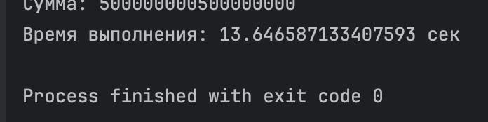
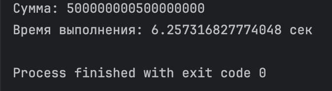
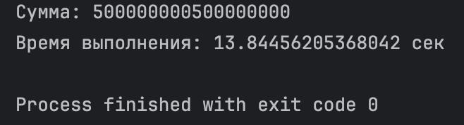

# Результаты 

1. Threading

```python
import threading
import time


def part_sum(start, end, result, index):
    result[index] = sum(range(start, end))


def calculate_sum_threading(n, num_threads):
    step = n // num_threads
    threads = []
    result = [0] * num_threads
    for i in range(num_threads):
        start = i * step + 1
        end = n + 1 if i == num_threads - 1 else (i + 1) * step + 1
        t = threading.Thread(target=part_sum, args=(start, end, result, i))
        threads.append(t)
        t.start()

    for t in threads:
        t.join()

    return sum(result)


if __name__ == "__main__":
    n = 10 ** 9
    start_time = time.time()
    total = calculate_sum_threading(n, 5)
    print("Сумма:", total)
    print("Время выполнения:", time.time() - start_time, "сек")
```



2. Multiprocessing

```python
from multiprocessing import Pool
import time


def part_sum(args):
    start, end = args
    return sum(range(start, end))


def calculate_sum_multiprocessing(n, num_processes):
    step = n // num_processes
    ranges = [(i * step + 1, n + 1 if i == num_processes - 1 else (i + 1) * step + 1) for i in range(num_processes)]
    with Pool(processes=num_processes) as pool:
        results = pool.map(part_sum, ranges)
    return sum(results)


if __name__ == "__main__":
    n = 10 ** 9
    start_time = time.time()
    total = calculate_sum_multiprocessing(n, 5)
    print("Сумма:", total)
    print("Время выполнения:", time.time() - start_time, "сек")
```



3. Async
```python
import asyncio
import time


async def partial_sum(start, end):
    return sum(range(start, end))


async def calculate_sum(n, num_tasks):
    step = n // num_tasks
    tasks = []

    for i in range(num_tasks):
        start = i * step + 1  
        end = n + 1 if i == num_tasks - 1 else (i + 1) * step + 1
        tasks.append(asyncio.create_task(partial_sum(start, end)))

    results = await asyncio.gather(*tasks)
    return sum(results)


if __name__ == "__main__":
    n = 10 ** 9
    start_time = time.time()
    result = asyncio.run(calculate_sum(n, 5))
    print("Сумма:", result)
    print("Время выполнения:", time.time() - start_time, "сек")
```



# Вывод:

Наиболее эффективным для ЦПУ задач является мультипроцессинг.